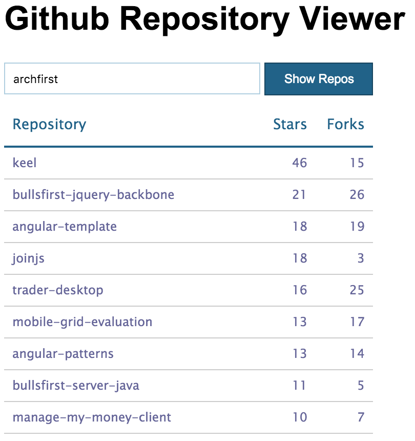

# JavaScript Module Loader Examples

Traditionally JavaScript didn't have any out-of-the-box way to modularize code. At best, people wrote their code in different files using various *module patterns* and concatenated these files before execution. Recently a number of module definition standards and loaders have sprung up to provide more robust modularization solutions. However, the sheer number of these solutions is mind boggling! The objective of this project is to provide simple examples of using some of the popular modularization solutions so that you can decide which one is the best for you.

We use a simple web app called *Github Repository Viewer* and show you how to modularized it. The app allows you to enter the name of a Github organization and displays its repositories sorted by their star ratings. Here's a screen shot of the application.



The simplest implementation of the app is in the `basic-plain-old-javascript` folder. It uses plain old JavaScript and the *Revealing Module Pattern* to modularize the [GithubService](https://github.com/archfirst/js-module-loader-examples/blob/master/plain-old-javascript/src/github.service.js). Other folders focus on different combinations of module definition specifications (such as ES2015 and TypeScript), module loaders and front-end frameworks. For example, the folder `es2015-systemjs` uses the ES2015 module specification along with the SystemJS module loader. Each folder contains a README.md file that describes the specifics of its environment.

If there is a module specification/loader that is not covered by this project and you are really passionate about it, please feel free to send us a pull request with your contribution. Note that you should create a separate directory for your contribution based on the guidelines stated above.

## Common Setup

Before running the applications in any sub-folder, you must install [lite-server](https://github.com/johnpapa/lite-server), a lightweight web server that will serve your application and also refresh it as you make code changes.

```bash
$ npm install lite-server -g
```

Once installed, change your directory to any of the subfolders and run the application by following the instructions in that subfolder.
